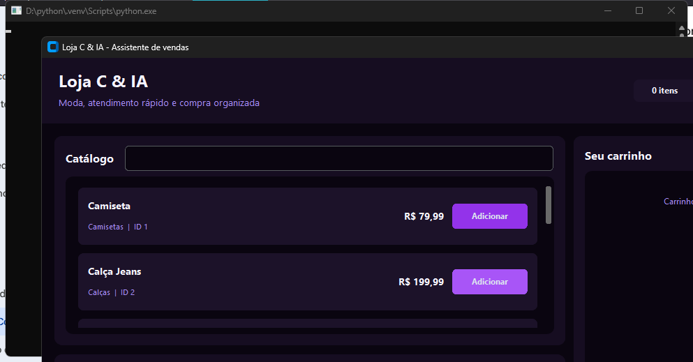

# Loja C & IA

Este projeto foi desenvolvido durante o curso de Programador de Sistemas no
Senac, com o objetivo de aplicar conceitos de POO em uma interface grafica.
A ideia foi criar uma loja simples, com catalogo de produtos, carrinho,
checkout, atendimento ao cliente e geracao de nota fiscal.



## Sobre o projeto

O sistema simula o atendimento de uma loja chamada **Loja C & IA**. A tela
principal permite pesquisar produtos, adicionar itens ao carrinho e finalizar
a compra informando os dados do cliente.

A versao principal usa Programacao Orientada a Objetos para organizar a logica
em uma classe de aplicacao, deixando as funcoes de interface, carrinho,
checkout e nota fiscal mais faceis de entender e manter.

## Logica do frete

Para deixar o projeto mais proximo de um caso real, escolhi alguns bairros de
Fortaleza para simular a entrega. Cada bairro possui um valor de frete
diferente:

- Aldeota: R$ 15,00
- Centro: R$ 10,00
- Messejana: R$ 20,00
- Benfica: R$ 12,00

No checkout, o programa soma o subtotal dos produtos com o frete do bairro
selecionado e mostra o total final da compra.

## Como executar

1. Crie e ative um ambiente virtual:

```powershell
python -m venv .venv
.venv\Scripts\activate
```

2. Instale as dependencias:

```powershell
pip install -r requirements.txt
```

3. Execute a versao POO:

```powershell
python "testbot usando (POO).py"
```

## Arquivos principais

- `testbot usando (POO).py`: versao orientada a objetos.
- `testbot sem o (POO).py`: versao sem orientacao a objetos.
- `EXPLICACAO_LINHA_A_LINHA (POO).md`: explicacao da versao POO.
- `EXPLICACAO_LINHA_A_LINHA (SEM POO).md`: explicacao da versao sem POO.

## Arquivos gerados

O app pode criar `suporte_contatos.txt` e a pasta `notas_fiscais/`.
Esses arquivos ficam fora do Git porque sao dados gerados durante o uso.
